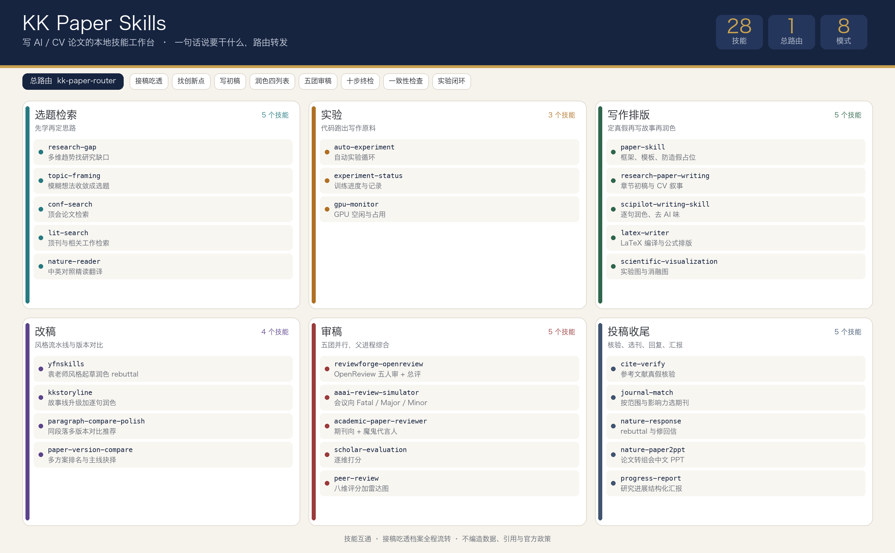

# kk-paper-skills

写 AI/CV 论文的整套本地 Agent Skills，含一个总路由。装好之后不用记 skill 名，直接说要干什么，`kk-paper-router` 会转发到对应技能。

## 安装

克隆后把各技能目录复制（或软链）到任一被扫描的技能目录，例如：

```bash
git clone https://github.com/songkang688/kk-paper-skills.git
cd kk-paper-skills
for d in */; do ln -sfn "$(pwd)/${d%/}" ~/.cursor/skills/"${d%/}"; done
```

Codex 用户把目标换成 `~/.codex/skills/` 即可。

## 技能一览



| 干什么 | 技能 |
|---|---|
| 总路由，判定意图并转发 | `kk-paper-router` |
| 找研究缺口（多维趋势分析） | `research-gap` |
| 模糊想法收敛成可研究选题 | `topic-framing` |
| 读论文、中英对照翻译 | `nature-reader` |
| 找文献 | `lit-search`，顶会论文用 `conf-search` |
| 框架、模板、防造假占位 | `paper-skill` |
| 章节初稿（CV 叙事） | `research-paper-writing` |
| 润色、翻译、去 AI 味 | `scipilot-writing-skill` |
| 实验结果图 | `scientific-visualization` |
| LaTeX 编译与排版 | `latex-writer` |
| 参考文献真假核验 | `cite-verify` |
| 审稿：OpenReview 五人审 + 总评 | `reviewforge-openreview` |
| 审稿：会议向交叉验证 | `aaai-review-simulator` |
| 审稿：期刊向 + 魔鬼代言人 | `academic-paper-reviewer` |
| 审稿：逐维打分 | `scholar-evaluation` |
| 审稿：8 维雷达图 | `peer-review` |
| 同段落多英文版本对比与润色推荐 | `paragraph-compare-polish` |
| 论文多方案/多版本对比与主线抉择 | `paper-version-compare` |
| 回复审稿意见 | `nature-response` |
| 选期刊 | `journal-match`（会议由 `paper-skill` venue 流程兜底） |
| 袁老师风格起草/润色/中翻英/审稿回复 | `yfnskills`（22 篇语料建模，自带四条工作流，md+PDF 成对交付） |
| 一键故事线升级加逐句润色 | `kkstoryline`（七步状态机流水线，双份意见、ToDoList、六路润色、三格式成稿） |
| 自动实验循环 | `auto-experiment`（THINK→EXECUTE→REFLECT，自己跑训练自己分析结果） |
| 实验进度与 GPU 状态 | `experiment-status`、`gpu-monitor` |
| 论文转组会 PPT | `nature-paper2ppt`（中文 PPTX 加讲稿备注） |
| 研究进展汇报 | `progress-report`（读实验日志出结构化报告） |

## 接稿吃透模式

第一次给路由一篇论文或代码包，它会先建档吃透再干活：锚定基准文件绝对路径，全文精读后把结构树、贡献声明、方法核心、实验设置、数值表、图表清单、术语表落盘到 `paper_context/<稿件名>/`，代码包另出模块地图并把禁改组件单独标注，最后用几句话向你汇报理解。之后所有模式（润色、审稿、终检、对比、rebuttal）启动都带上基准稿和档案路径，派子 agent 时路径写进 prompt，一切改动以这篇论文为核心。给了新版本就更新档案，旧版作废。

## 技能互通

各技能不是孤岛。`paragraph-compare-polish` 出最终润色版时按 polish-mode 的四列契约和 11 条风格规则执行，`paper-version-compare` 选完主线要改稿时接润色模式，找创新点出的方案要写成章节时走写初稿流程。互通时各技能的铁律同时生效，冲突以更严格的一方为准。

## 找创新点模式

对路由说找创新点或选题，它会走五步：先用 `conf-search` 和 `lit-search` 学近两年顶会顶刊论文（默认 100 篇，逐篇短卡落盘），再用 `research-gap` 出缺口报告并列做烂清单，然后不设边界发散候选思路，按创新性、可行性、故事性、审稿风险收敛选出 3 个并用 `topic-framing` 定成可研究的题目。要代码时每个方案交付一份完整可直接训练的 py 文件，核心组件与用户提供的参考实现逐行一致，写完独立检查 3 遍（逐行 diff、语法导入、训练闭环走查）。

## 审稿模式

对路由说审稿，它会并行派发 5 个子 agent（reviewforge、aaai、期刊团、scholar-eval、peer-review），各自独立出报告，落盘到 `paper_reviews/<时间>/01-05` 五个文件，父进程汇总共识、分歧和 P0/P1/P2 清单写入 `00-final-verdict.md`。

## 润色模式

对路由说润色，它会先按段落再按句子拆分，每句独立跑一遍 `scipilot-writing-skill`，最后汇总成四列完整对照表：改前、改后、改了什么、为什么。不超过两段直接在对话里给表，超过两段落盘为 `polish_reports/<时间>-润色对照.md`。

## 终检模式

对路由说发表前最终审查，它会跑一次十步全面体检：全局一致性、逐句语言体检（语法、时态、拼写、用词、句长、lint）、标点与微排版（中英文标点、连字符与破折号、数字单位空格、缩写标点）、数学公式与符号、图表细节（编号、图注自足、三线表、有效数字、色盲可读）、引用与参考文献双向核对、数值一致与占位符清零、格式合规（联网抓官方模板，实测页数、字体嵌入、匿名处理）、投稿材料与元数据（含 PDF 属性泄匿名检查），最后输出体检总表和按 P0/P1/P2 分级的问题清单，每条带位置、原文、建议改法。

## 写作固定顺序

`paper-skill` 定真假 → `research-paper-writing` 写故事 → `scipilot-writing-skill` 润表达。审稿与写作不混在同一轮。

## 自治工作流

`yfnskills`（袁老师写作风格）和 `kkstoryline`（一键改稿流水线）是完整的自治工作流，路由只转发不拆解步骤。提到袁老师、袁非牛、yfn 就走 `yfnskills`，说跑 kkstoryline、一键改论文、故事线升级就走 `kkstoryline`。

要不要往里注入本系统的语言标准，看该流水线自己有多厚，两者不一视同仁。`yfnskills` 不注入，它自带 80 条规则白名单和按章节量化的语言画像，是自成体系的作者风格，塞别的规则会打架。`kkstoryline` 注入第 5 步，它的润色标准卡流程厚但句子层面只有「更紧凑更专业更地道」一句空话，所以派发 6 个润色子 agent 时把 polish-mode 的 11 条语句风格作为判据写进 prompt，执行调 `scipilot-writing-skill` 并跑 writing_lint 自检。这条以 e) 条写在 `kkstoryline/SKILL.md` 第五节派发模板里，属本地增补，升级上游包后要重新加回。

两者都依赖 `md2pdf.py` 出 PDF，换机器先跑 `python md2pdf.py --check`。

## 实验模式

对路由说跑实验、训练怎么样了、GPU 空不空，分别走 `auto-experiment`、`experiment-status`、`gpu-monitor`。与论文系统的衔接是双向的：找创新点模式交付的可训练代码就是实验对象，启动前没有 `PROJECT_BRIEF.md` 就从选中的方案生成一份让你确认；实验跑完 `MEMORY_LOG.md` 里的结果回流当写作数值底本，稿里每个数字都要能回指到一条实验记录。禁改组件（如 LoRA 定义）在实验迭代里同样不许动。

## 外部依赖技能

路由还会调用少量不随本仓库分发的本机技能，新机器上没有时对应环节降级但不阻断：接稿吃透的 PDF 转文本用 `pdf-to-md` / `pdf-to-tex`（缺了改用 pymupdf 直转），找创新点的单篇精读用 `paper-analyze`（缺了由父进程直接精读），特定项目稿件的事实核对叠加对应项目技能（如 `zerosmoke`）。

## 说明

- 各技能保留原作者的 LICENSE 与出处，见各目录。
- 所有审稿输出为非官方自检，不代表任何会议或期刊，也不预测真实中稿。
